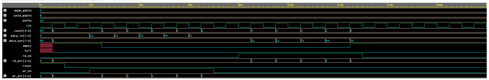

# Synchronous FIFO using Verilog HDL

A **parameterized synchronous FIFO (First-In First-Out) buffer** implemented using **Verilog HDL**, simulated and verified on **EDA Playground**.  
This project demonstrates correct FIFO operation using waveform-based verification.

## Features
- Single-clock **synchronous FIFO**
- Configurable **data width** and **FIFO depth**
- Proper **full** and **empty** flag generation
- Verified using testbench and waveform analysis
- Clean and synthesizable RTL design

## Design Overview
- **Memory Array** for data storage  
- **Write Pointer (`wr_ptr`)** to track write location  
- **Read Pointer (`rd_ptr`)** to track read location  
- **Counter (`count`)** to monitor FIFO occupancy  
- Flow control using `full` and `empty` signals  

## Working Principle
- Data is written when `wr_en = 1` and `full = 0`
- Data is read when `rd_en = 1` and `empty = 0`
- FIFO preserves **First-In First-Out** ordering
- `full` asserts when FIFO reaches maximum depth
- `empty` asserts when FIFO becomes empty

## Simulation Output

## Tools Used
- Verilog HDL  
- Icarus Verilog  
- EPWave (Waveform Viewer)  
- EDA Playground  

## 🚀 Applications
- Data buffering
- Producer–consumer systems
- Communication interfaces (UART, SPI)
- Digital pipeline designs
